### SurfaceSplat: Connecting Surface Reconstruction and Gaussian Splatting
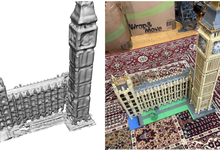

- Authors: Z. Gao*, **J.-W. Bian***, G. Lin, H. Chen, C. Shen
- Venue: International Conference on Computer Vision (ICCV), 2025
- Links: [arXiv](https://arxiv.org/abs/2507.15602) | [Code](https://github.com/Gaozihui/SurfaceSplat) | [Scholar](https://scholar.google.com/scholar?q=SurfaceSplat%3A%20Connecting%20Surface%20Reconstruction%20and%20Gaussian%20Splatting)
- TLDR: Fuses signed-distance surface reconstruction with 3D Gaussian splats under a single optimisation so sparse multi-view data yields crisp, photo-consistent surfaces.

---

### RoboPearls: Editable Video Simulation for Robot Manipulation
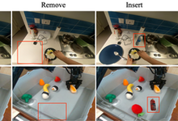

- Authors: T. Tang, L. Zhang, Y. Wen, K. Zhang, **J.-W. Bian**, T. Yan, K. Zhan, P. Jia, H. Wu, L. Lin, X. Liang
- Venue: International Conference on Computer Vision (ICCV), 2025
- Links: [Project](https://tangtaogo.github.io/RoboPearls/) | [arXiv](https://arxiv.org/abs/2506.22756) | [Scholar](https://scholar.google.com/scholar?q=RoboPearls%3A%20Editable%20Video%20Simulation%20for%20Robot%20Manipulation)
- TLDR: Packages raw tele-operated videos into editable “pearls” that can be relabelled, simulated, and reused to train or retarget robot manipulation policies without recollecting data.

---

### Manydepth2: Motion-aware Self-supervised Monocular Depth Estimation in Dynamic Scenes
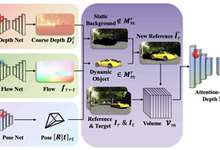

- Authors: K. Zhou, **J.-W. Bian**, J.-Q. Zheng, J. Zhong, Q. Xie, N. Trigoni, A. Markham
- Venue: IEEE Robotics and Automation Letters (RA-L), 2025
- Links: [Paper](https://doi.org/10.1109/LRA.2025.3568337) | [Code](https://github.com/kaichen-z/Manydepth2) | [Scholar](https://scholar.google.com/scholar?q=Manydepth2%3A%20Motion-aware%20Self-supervised%20Monocular%20Depth%20Estimation%20in%20Dynamic%20Scenes)
- TLDR: Couples learned motion masks with temporal flow cues so self-supervised monocular depth stays stable on highly dynamic street scenes.

---

### PoRF: Pose Residual Field for Accurate Neural Surface Reconstruction
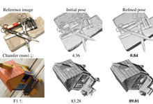

- Authors: **J.-W. Bian**, W. Bian, V. A. Prisacariu, P. H. Torr
- Venue: International Conference on Learning Representations (ICLR), 2024
- Links: [Project](https://porf.active.vision/) | [arXiv](https://arxiv.org/abs/2310.07449) | [Code](https://github.com/ActiveVisionLab/porf) | [Scholar](https://scholar.google.com/scholar?q=PoRF%3A%20Pose%20Residual%20Field%20for%20Accurate%20Neural%20Surface%20Reconstruction)
- TLDR: Predicts pose residual fields inside the neural surface optimiser, continually correcting camera drift to recover sharp geometry and textures.

---

### GaussCtrl: Multi-View Consistent Text-Driven 3D Gaussian Splatting Editing
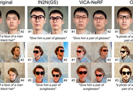

- Authors: J. Wu, **J.-W. Bian**, X. Li, G. Wang, I. Reid, P. Torr, V. Prisacariu
- Venue: European Conference on Computer Vision (ECCV), 2024
- Links: [Project](https://gaussctrl.active.vision/) | [Paper](https://www.ecva.net/papers/eccv_2024/papers_ECCV/html/2153_ECCV_2024_paper.php) | [arXiv](https://arxiv.org/abs/2403.08733) | [Code](https://github.com/ActiveVisionLab/gaussctrl) | [Scholar](https://scholar.google.com/scholar?q=GaussCtrl%3A%20Multi-View%20Consistent%20Text-Driven%203D%20Gaussian%20Splatting%20Editing)
- TLDR: Drives 3D Gaussian splat editing with text prompts while enforcing multi-view control signals that keep geometry and appearance consistent across cameras.

---

### Neural Refinement for Absolute Pose Regression with Feature Synthesis
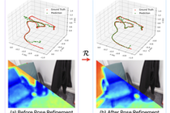

- Authors: S. Chen, Y. Bhalgat, X. Li, **J.-W. Bian**, K. Li, Z. Wang, V. A. Prisacariu
- Venue: IEEE Conference on Computer Vision and Pattern Recognition (CVPR), 2024
- Links: [Project](https://nefes.active.vision/) | [Paper](https://openaccess.thecvf.com/content/CVPR2024/html/Chen_Neural_Refinement_for_Absolute_Pose_Regression_with_Feature_Synthesis_CVPR_2024_paper.html) | [arXiv](https://arxiv.org/abs/2303.10087) | [Code](https://github.com/ActiveVisionLab/NeFeS) | [Scholar](https://scholar.google.com/scholar?q=Neural%20Refinement%20for%20Absolute%20Pose%20Regression%20with%20Feature%20Synthesis)
- TLDR: Synthesises intermediate feature residuals that refine absolute pose regression outputs, lifting localisation accuracy without any extra 3D supervision.

---

### SC-DepthV3: Robust Self-supervised Monocular Depth Estimation for Dynamic Scenes
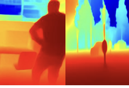

- Authors: L. Sun*, **J.-W. Bian***, H. Zhan, W. Yin, I. Reid, C. Shen
- Venue: IEEE Transactions on Pattern Analysis and Machine Intelligence (TPAMI), 2023
- Links: [arXiv](https://arxiv.org/abs/2211.03660) | [Code](https://github.com/JiawangBian/sc_depth_pl) | [Scholar](https://scholar.google.com/scholar?q=SC-DepthV3%3A%20Robust%20Self-supervised%20Monocular%20Depth%20Estimation%20for%20Dynamic%20Scenes)
- TLDR: Distils pretrained single-image depth priors into the self-supervised pipeline so monocular depth remains detailed and stable in dynamic environments.

---

### NoPe-NeRF: Optimising Neural Radiance Field with No Pose Prior
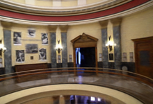

- Authors: W. Bian, Z. Wang, K. Li, **J.-W. Bian**, V. A. Prisacariu
- Venue: IEEE Conference on Computer Vision and Pattern Recognition (CVPR), 2023
- Links: [Project](https://nopenet.active.vision/) | [arXiv](https://arxiv.org/abs/2212.07388) | [Code](https://github.com/ActiveVisionLab/NoPe-NeRF) | [Scholar](https://scholar.google.com/scholar?q=NoPe-NeRF%3A%20Optimising%20Neural%20Radiance%20Field%20with%20No%20Pose%20Prior)
- TLDR: Optimises NeRF and camera parameters jointly with a pose-free likelihood, removing the need for SfM pose initialisation on unordered photo collections.

---

### MobileBrick: Building LEGO for 3D Reconstruction on Mobile Devices
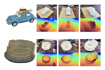

- Authors: K. Li, **J.-W. Bian**, R. Castle, P. Torr, V. A. Prisacariu
- Venue: IEEE Conference on Computer Vision and Pattern Recognition (CVPR), 2023
- Links: [Project](https://code.active.vision/MobileBrick/) | [arXiv](https://arxiv.org/abs/2303.01932) | [Code](https://github.com/ActiveVisionLab/MobileBrick) | [Scholar](https://scholar.google.com/scholar?q=MobileBrick%3A%20Building%20LEGO%20for%203D%20Reconstruction%20on%20Mobile%20Devices)
- TLDR: Introduces a phone-based capture rig and lightweight optimiser that turns casual handheld footage into LEGO-style 3D assets entirely on-device.

---

### Auto-Rectify Network for Unsupervised Indoor Depth Estimation
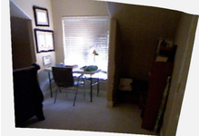

- Authors: **J.-W. Bian**, H. Zhan, N. Wang, T.-J. Chin, C. Shen, I. Reid
- Venue: IEEE Transactions on Pattern Analysis and Machine Intelligence (TPAMI), 2022
- Links: [arXiv](https://arxiv.org/abs/2006.02708) | [Code](https://github.com/JiawangBian/sc_depth_pl) | [Scholar](https://scholar.google.com/scholar?q=Auto-Rectify%20Network%20for%20Unsupervised%20Indoor%20Depth%20Estimation)
- TLDR: Learns an auto-rectify module and depth network jointly so handheld indoor videos can be geometrically corrected and depth-estimated without supervision.

---

### Unsupervised Scale-consistent Depth Learning from Video
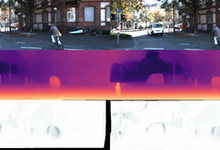

- Authors: **J.-W. Bian**, H. Zhan, N. Wang, Z. Li, L. Zhang, C. Shen, M.-M. Cheng, I. Reid
- Venue: International Journal of Computer Vision (IJCV), 2021
- Links: [arXiv](https://arxiv.org/abs/1908.10553) | [Code](https://github.com/JiawangBian/SC-SfMLearner-Release) | [Scholar](https://scholar.google.com/scholar?q=Unsupervised%20Scale-consistent%20Depth%20Learning%20from%20Video)
- TLDR: Enforces cross-frame scale-consistency losses so unsupervised monocular depth predictions retain a stable metric scale across long video sequences.

---

### Visual Odometry Revisited: What Should Be Learnt?
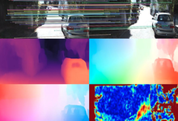

- Authors: H. Zhan, C. S. Weerasekera, **J.-W. Bian**, I. Reid
- Venue: International Conference on Robotics and Automation (ICRA), 2020
- Links: [arXiv](https://arxiv.org/abs/1909.09803) | [Code](https://github.com/Huangying-Zhan/DF-VO) | [Scholar](https://scholar.google.com/scholar?q=Visual%20Odometry%20Revisited%3A%20What%20Should%20Be%20Learnt%3F)
- TLDR: Dissects learning-based visual odometry to pinpoint which modules benefit from data-driven learning versus classic geometric priors for best robustness.

---

### GMS: Grid-based Motion Statistics for Fast, Ultra-robust Feature Correspondence
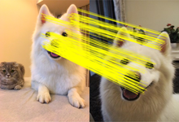

- Authors: **J.-W. Bian**, W.-Y. Lin, Y. Liu, L. Zhang, S.-K. Yeung, M.-M. Cheng, I. Reid
- Venue: International Journal of Computer Vision (IJCV), 2020
- Links: [Paper](https://openaccess.thecvf.com/content_cvpr_2017/papers/Bian_GMS_Grid-based_Motion_CVPR_2017_paper.pdf) | [Code](https://github.com/JiawangBian/GMS-Feature-Matcher) | [Scholar](https://scholar.google.com/scholar?q=GMS%3A%20Grid-based%20Motion%20Statistics%20for%20Fast%2C%20Ultra-robust%20Feature%20Correspondence)
- TLDR: Uses grid-based motion statistics to filter correspondences, delivering extremely fast feature matching that stays robust to heavy outliers.
