### Feed-Forward 3D Scene Modeling: A Problem-Driven Perspective
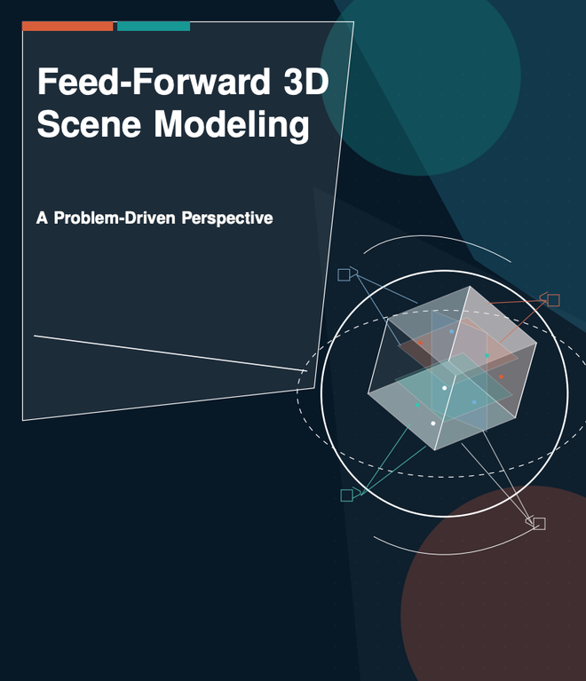

- Authors: W. Wang, Q. Cao, S. Gao, D. Chen, H. Xu, W. Bian, S. Peng, T. Cham, C. Zheng, A. Geiger, J. Cai, **J.-W. Bian**, B. Zhuang
- Venue: arXiv, 2026
- Links: [Project](https://ff3d-survey.github.io) | [arXiv](https://arxiv.org/abs/2604.14025) | [Code](https://github.com/ziplab/Awesome-Feed-Forward-3D) | [Scholar](https://scholar.google.com/scholar?q=Feed-Forward+3D+Scene+Modeling+A+Problem-Driven+Perspective)
- TLDR: A survey of feed-forward 3D scene reconstruction methods, organized around five core design problems: feature enhancement, geometry awareness, model efficiency, augmentation, and temporal modeling.

---

### OneWorld: Taming Scene Generation with 3D Unified Representation Autoencoder
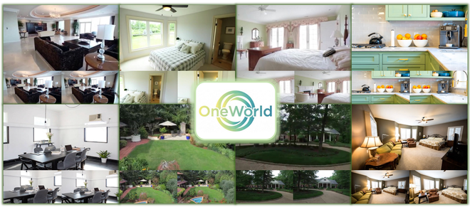

- Authors: S. Gao, Z. Wang, Q. Cao, D. Yu, C. Wang, T. Liu, M. Gong, **J.-W. Bian**
- Venue: European Conference on Computer Vision (ECCV), 2026
- Links: [arXiv](https://arxiv.org/abs/2603.16099) | [Code](https://github.com/SensenGao/OneWorld) | [Scholar](https://scholar.google.com/scholar?q=OneWorld+Taming+Scene+Generation+3D+Unified+Representation+Autoencoder)
- TLDR: A 3D unified representation autoencoder for coherent multi-view scene generation with cross-view consistency and reduced train-inference discrepancy.

---

### Taming Camera-Controlled Video Generation with Verifiable Geometry Reward
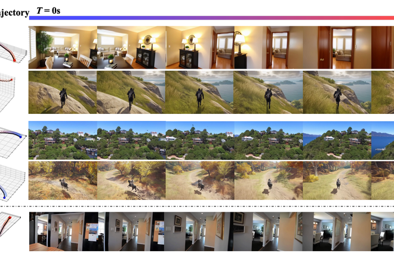

- Authors: Z. Wang, X. Xia, Z. Bie, J. Liu, D. Yu, **J.-W. Bian**, C. Wang
- Venue: European Conference on Computer Vision (ECCV), 2026
- Links: [arXiv](https://arxiv.org/abs/2512.02870) | [Scholar](https://scholar.google.com/scholar?q=Taming+Camera-Controlled+Video+Generation+with+Verifiable+Geometry+Reward)
- TLDR: An online RL post-training framework that uses verifiable geometry rewards with dense segment-level feedback to improve camera trajectory control in video diffusion models.

---

### Thinking with Geometry: Active Geometry Integration for Spatial Reasoning
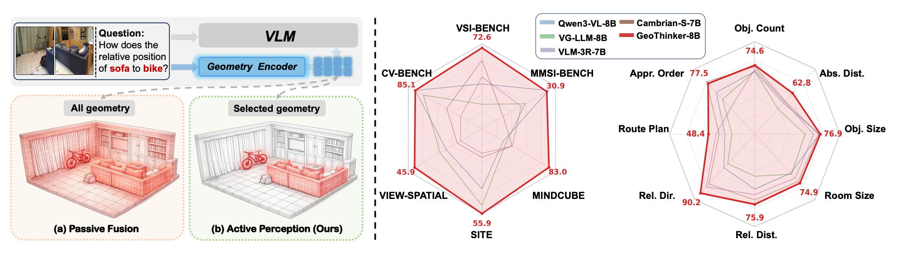

- Authors: H. Li, Q. Cao, T. Tang, K. Xiang, Z. Guo, J. Han, H. Xu, **J.-W. Bian**, X. Liang
- Venue: International Conference on Machine Learning (ICML), 2026
- Links: [arXiv](https://arxiv.org/abs/2602.06037) | [Code](https://github.com/Li-Hao-yuan/GeoThinker) | [Scholar](https://scholar.google.com/scholar?q=Thinking+with+Geometry+Active+Geometry+Integration+Spatial+Reasoning)
- TLDR: GeoThinker enables multimodal LLMs to actively retrieve and integrate geometric information for spatial reasoning, achieving state-of-the-art on VSI-Bench.

---

<!-- HIDDEN: OmniGen
### OmniGen: Unified Multimodal Sensor Generation for Autonomous Driving
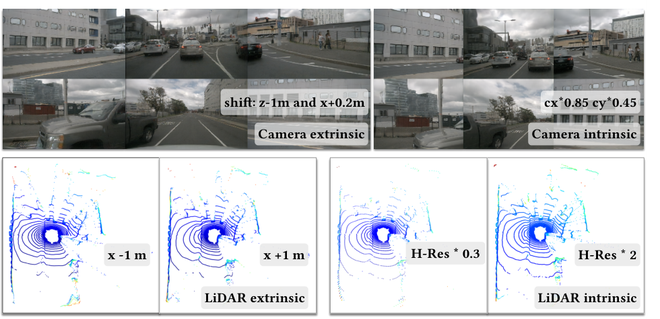

- Authors: T. Tang, E. Ma, X. Zhou, L. Wang, T. Yan, X. Zhang, K. Zhan, P. Jia, X. Lang, **J.-W. Bian**, K. Yu, X. Liang
- Venue: ACM International Conference on Multimedia (MM), 2025
- Links: [Paper](https://doi.org/10.1145/3746027.3754772) | [arXiv](https://arxiv.org/abs/2512.14225) | [Scholar](https://scholar.google.com/scholar?q=OmniGen%3A%20Unified%20Multimodal%20Sensor%20Generation%20for%20Autonomous%20Driving)
- TLDR: Unified framework that controllably generates aligned LiDAR and multi-view camera data for autonomous driving with cross-modality consistency and flexible sensor control.
-->

---

### SurfaceSplat: Connecting Surface Reconstruction and Gaussian Splatting
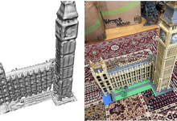

- Authors: Z. Gao, **J.-W. Bian**, G. Lin, H. Chen, C. Shen
- Venue: International Conference on Computer Vision (ICCV), 2025
- Links: [arXiv](https://arxiv.org/abs/2507.15602) | [Code](https://github.com/Gaozihui/SurfaceSplat) | [Scholar](https://scholar.google.com/scholar?q=SurfaceSplat%3A+Connecting+Surface+Reconstruction+and+Gaussian+Splatting)
- TLDR: Fuses signed-distance surface reconstruction with 3D Gaussian splats under a single optimisation so sparse multi-view data yields crisp, photo-consistent surfaces.

---

### RoboPearls: Editable Video Simulation for Robot Manipulation
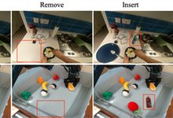

- Authors: T. Tang, L. Zhang, Y. Wen, K. Zhang, **J.-W. Bian**, T. Yan, K. Zhan, P. Jia, H. Wu, L. Lin, X. Liang
- Venue: International Conference on Computer Vision (ICCV), 2025
- Links: [Project](https://tangtaogo.github.io/RoboPearls/) | [arXiv](https://arxiv.org/abs/2506.22756) | [Scholar](https://scholar.google.com/scholar?q=RoboPearls%3A+Editable+Video+Simulation+for+Robot+Manipulation)
- TLDR: Packages raw tele-operated videos into editable "pearls" that can be relabelled, simulated, and reused to train or retarget robot manipulation policies without recollecting data.

---

<!-- HIDDEN: Manydepth2
### Manydepth2: Motion-aware Self-supervised Monocular Depth Estimation in Dynamic Scenes
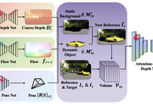

- Authors: K. Zhou, **J.-W. Bian**, J.-Q. Zheng, J. Zhong, Q. Xie, N. Trigoni, A. Markham
- Venue: IEEE Robotics and Automation Letters (RA-L), 2025
- Links: [Paper](https://doi.org/10.1109/LRA.2025.3568337) | [Code](https://github.com/kaichen-z/Manydepth2) | [Scholar](https://scholar.google.com/scholar?q=Manydepth2%3A+Motion-aware+Self-supervised+Monocular+Depth+Estimation+in+Dynamic+Scenes)
- TLDR: Couples learned motion masks with temporal flow cues so self-supervised monocular depth stays stable on highly dynamic street scenes.
-->

---

### GaussCtrl: Multi-View Consistent Text-Driven 3D Gaussian Splatting Editing
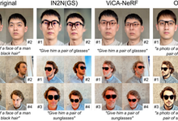

- Authors: J. Wu, **J.-W. Bian**, X. Li, G. Wang, I. Reid, P. Torr, V. Prisacariu
- Venue: European Conference on Computer Vision (ECCV), 2024
- Links: [Project](https://gaussctrl.active.vision/) | [arXiv](https://arxiv.org/abs/2403.08733) | [Code](https://github.com/ActiveVisionLab/gaussctrl) | [Scholar](https://scholar.google.com/scholar?q=GaussCtrl%3A+Multi-View+Consistent+Text-Driven+3D+Gaussian+Splatting+Editing)
- TLDR: Drives 3D Gaussian splat editing with text prompts while enforcing multi-view control signals that keep geometry and appearance consistent across cameras.

---

### PoRF: Pose Residual Field for Accurate Neural Surface Reconstruction
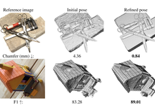

- Authors: **J.-W. Bian**, W. Bian, V. A. Prisacariu, P. H. Torr
- Venue: International Conference on Learning Representations (ICLR), 2024
- Links: [Project](https://porf.active.vision/) | [arXiv](https://arxiv.org/abs/2310.07449) | [Code](https://github.com/ActiveVisionLab/porf) | [Scholar](https://scholar.google.com/scholar?q=PoRF%3A+Pose+Residual+Field+for+Accurate+Neural+Surface+Reconstruction)
- TLDR: Predicts pose residual fields inside the neural surface optimiser, continually correcting camera drift to recover sharp geometry and textures.

---

### NoPe-NeRF: Optimising Neural Radiance Field with No Pose Prior
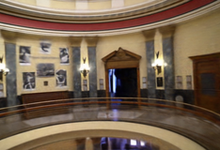

- Authors: W. Bian, Z. Wang, K. Li, **J.-W. Bian**, V. A. Prisacariu
- Venue: IEEE Conference on Computer Vision and Pattern Recognition (CVPR), 2023
- Links: [Project](https://nopenet.active.vision/) | [arXiv](https://arxiv.org/abs/2212.07388) | [Code](https://github.com/ActiveVisionLab/NoPe-NeRF) | [Scholar](https://scholar.google.com/scholar?q=NoPe-NeRF%3A+Optimising+Neural+Radiance+Field+with+No+Pose+Prior)
- TLDR: Optimises NeRF and camera parameters jointly with a pose-free likelihood, removing the need for SfM pose initialisation on unordered photo collections.

---

### MobileBrick: Building LEGO for 3D Reconstruction on Mobile Devices
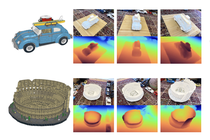

- Authors: K. Li, **J.-W. Bian**, R. Castle, P. Torr, V. A. Prisacariu
- Venue: IEEE Conference on Computer Vision and Pattern Recognition (CVPR), 2023
- Links: [Project](https://code.active.vision/MobileBrick/) | [arXiv](https://arxiv.org/abs/2303.01932) | [Code](https://github.com/ActiveVisionLab/MobileBrick) | [Scholar](https://scholar.google.com/scholar?q=MobileBrick%3A+Building+LEGO+for+3D+Reconstruction+on+Mobile+Devices)
- TLDR: Introduces a phone-based capture rig and lightweight optimiser that turns casual handheld footage into LEGO-style 3D assets entirely on-device.

---

### SC-DepthV3: Robust Self-supervised Monocular Depth Estimation for Dynamic Scenes
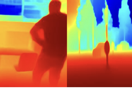

- Authors: L. Sun, **J.-W. Bian**, H. Zhan, W. Yin, I. Reid, C. Shen
- Venue: IEEE Transactions on Pattern Analysis and Machine Intelligence (TPAMI), 2023
- Links: [arXiv](https://arxiv.org/abs/2211.03660) | [Code](https://github.com/JiawangBian/sc_depth_pl) | [Scholar](https://scholar.google.com/scholar?q=SC-DepthV3%3A+Robust+Self-supervised+Monocular+Depth+Estimation+for+Dynamic+Scenes)
- TLDR: Distils pretrained single-image depth priors into the self-supervised pipeline so monocular depth remains detailed and stable in dynamic environments.

---

### [SC-DepthV2] Auto-Rectify Network for Unsupervised Indoor Depth Estimation
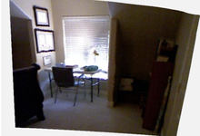

- Authors: **J.-W. Bian**, H. Zhan, N. Wang, T.-J. Chin, C. Shen, I. Reid
- Venue: IEEE Transactions on Pattern Analysis and Machine Intelligence (TPAMI), 2022
- Links: [arXiv](https://arxiv.org/abs/2006.02708) | [Code](https://github.com/JiawangBian/sc_depth_pl) | [Scholar](https://scholar.google.com/scholar?q=Auto-Rectify+Network+for+Unsupervised+Indoor+Depth+Estimation)
- TLDR: Learns an auto-rectify module and depth network jointly so handheld indoor videos can be geometrically corrected and depth-estimated without supervision.

---

### [SC-Depth] Unsupervised Scale-consistent Depth Learning from Video
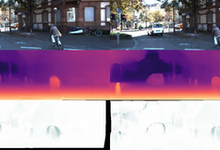

- Authors: **J.-W. Bian**, H. Zhan, N. Wang, Z. Li, L. Zhang, C. Shen, M.-M. Cheng, I. Reid
- Venue: International Journal of Computer Vision (IJCV), 2021
- Links: [arXiv](https://arxiv.org/abs/1908.10553) | [Code](https://github.com/JiawangBian/SC-SfMLearner-Release) | [Scholar](https://scholar.google.com/scholar?q=Unsupervised+Scale-consistent+Depth+Learning+from+Video)
- TLDR: Enforces cross-frame scale-consistency losses so unsupervised monocular depth predictions retain a stable metric scale across long video sequences.

---

### GMS: Grid-based Motion Statistics for Fast, Ultra-robust Feature Correspondence
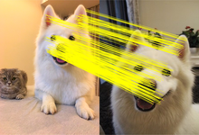

- Authors: **J.-W. Bian**, W.-Y. Lin, Y. Liu, L. Zhang, S.-K. Yeung, M.-M. Cheng, I. Reid
- Venue: IEEE Conference on Computer Vision and Pattern Recognition (CVPR), 2017
- Links: [Paper](https://openaccess.thecvf.com/content_cvpr_2017/papers/Bian_GMS_Grid-based_Motion_CVPR_2017_paper.pdf) | [Code](https://github.com/JiawangBian/GMS-Feature-Matcher) | [Scholar](https://scholar.google.com/scholar?q=GMS+Grid-based+Motion+Statistics+Fast+Ultra-robust+Feature+Correspondence)
- TLDR: Uses grid-based motion statistics to filter correspondences, delivering extremely fast feature matching that stays robust to heavy outliers.
